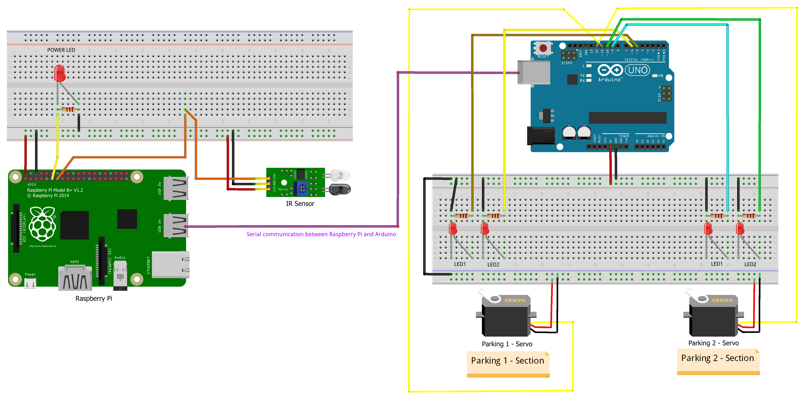
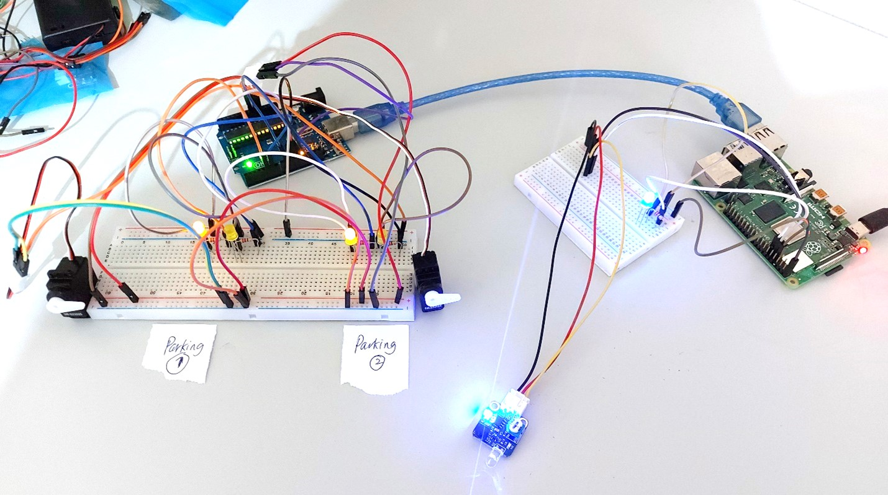

# Smart Parking using Raspberry Pi and Arduino

A parking space consists of two LEDs and a servo motor and a car presence sensor. The servo motor is used to block the parking space when it is not reserved and when the person who has reserved has not yet activated his space. The LEDs indicate the status of the parking space (taken, reserved, occupied, free).

#### Purpose
To create an intelligent parking. To simplify, you will have two parking spaces to manage.

#### Language
Implementation in Python with Raspberry Pi 4 

#### Wiring 

#### Setup 

#### Plugins and others

| Plugins             | Source                                                                 |
| ----------------- | ------------------------------------------------------------------ |
| Servo.h | https://www.arduino.cc/reference/en/libraries/servo/ |
| Arduino | https://www.arduino.cc/ |
| Raspberry Pi 4B | https://www.raspberrypi.com/products/raspberry-pi-4-model-b/ |

## 🚀 About Me
I'm a full stack developer...

Author: Hemant Ramphul  
Github: https://github.com/hemantramphul/Smart-Parking  
Date: 05 January 2023  

___

##### Université des Mascareignes (UdM)
Faculty of Information and Communication Technology  
Master Artificial Intelligence and Robotics  
Official Website: https://udm.ac.mu  

**Free Software, Source Code, Enjoy!** 👋
